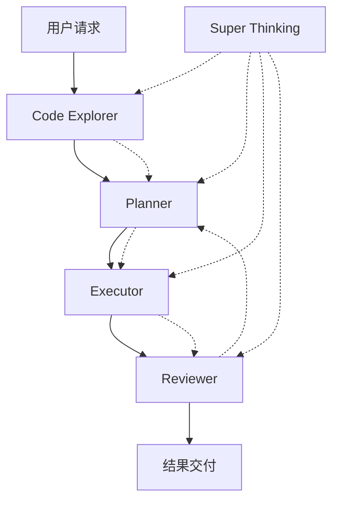

# Claude Subagents 系统

这是为 json2ts 项目配置的 Claude Subagents 智能协作系统，实现了代码探索、计划制定、方案执行、质量审查的完整工作流程。

## 📋 系统概览

### 🤖 Subagents 团队

| Agent | 职责 | 专长领域 |
|-------|------|----------|
| **Code Explorer** | 代码探索分析 | 架构理解、模式识别、问题发现 |
| **Planner** | 计划制定 | 需求分析、任务分解、风险评估 |
| **Executor** | 方案执行 | 代码实现、系统集成、测试执行 |
| **Reviewer** | 质量审查 | 代码审查、安全检查、最佳实践 |
| **Super Thinking** | 超思维模式 | 深度分析、创新解决方案、系统思维 |

### 🔄 工作流程



## 🚀 快速开始

### 激活 Subagents
Claude Code 会自动识别 `.claude` 配置并激活相应的 subagents。

### 使用开发工作流
```bash
# 完整开发流程示例
claude "帮我为项目添加配置文件支持功能"

# 系统会自动执行：
# 1. Code Explorer: 分析现有代码结构
# 2. Planner: 制定实施计划
# 3. Executor: 实现代码变更
# 4. Reviewer: 质量审查和验证
```

### 使用分析工作流
```bash
# 深度代码分析
claude "深度分析这个项目的架构设计"

# 系统会执行专门的分析流程：
# 1. 初步探索
# 2. 深度分析
# 3. 洞察综合
# 4. 验证审查
```

### 激活超思维模式
```bash
# 显式激活
claude "用超思维模式帮我优化这个算法"

# 自动激活条件：
# - 问题复杂度高
# - 需要创新解决方案
# - 多种方案需要选择
# - 战略性技术决策
```

## 📁 配置文件结构

```
.claude/
├── subagents/                # Subagent 定义文件
│   ├── code-explorer.md      # 代码探索专家
│   ├── planner.md           # 计划制定专家
│   ├── executor.md          # 方案执行专家
│   ├── reviewer.md          # 质量审查专家
│   └── super-thinking.md    # 超思维模式专家
├── workflows/               # 工作流配置
│   ├── development.yaml     # 开发工作流
│   └── analysis.yaml       # 分析工作流
├── settings.json           # 系统设置和配置
└── README.md              # 系统文档（本文件）
```

## ⚙️ 核心功能

### 🔍 智能代码探索
- **全面分析**：项目结构、技术栈、依赖关系
- **模式识别**：设计模式、架构模式、代码模式
- **问题发现**：质量问题、性能瓶颈、安全隐患
- **改进建议**：重构机会、优化方向、技术升级

### 📋 精确计划制定
- **需求分析**：理解业务需求和技术约束
- **任务分解**：复杂项目的模块化拆解
- **风险评估**：技术风险和实施风险识别
- **资源规划**：时间估算和依赖管理

### ⚡ 高效方案执行
- **代码实现**：遵循最佳实践的高质量代码
- **自动化测试**：完整的测试覆盖和验证
- **持续集成**：构建、测试、部署流程
- **进度跟踪**：实时状态更新和问题反馈

### ✅ 严格质量审查
- **代码审查**：结构、性能、可维护性检查
- **安全验证**：漏洞扫描、权限检查、数据保护
- **合规检查**：编码规范、最佳实践遵循
- **性能评估**：效率分析、资源使用优化

### 🧠 超思维深度分析
- **系统思维**：全局视角的复杂系统分析
- **创新解决**：突破常规的创新方案设计
- **深度洞察**：问题本质的多维度理解
- **战略规划**：长期技术发展方向指导

## 🎯 项目适配

### JSON2TS 项目特化
- **Go 语言专精**：深度理解 Go 语言特性和最佳实践
- **JSON 处理优化**：JSON 解析和类型推断算法优化
- **TypeScript 生成**：准确的 TS 类型定义生成
- **CLI 工具改进**：用户体验和功能扩展建议

### 智能适配特性
- **技术栈识别**：自动识别项目使用的技术和框架
- **规范遵循**：遵循项目现有的编码风格和约定
- **渐进式改进**：最小化破坏性变更的渐进优化
- **性能监控**：关注 CLI 工具的启动速度和内存使用

## 🔧 自定义配置

### 修改 Agent 行为
编辑对应的 `.md` 文件来自定义 agent 的行为和专长：

```markdown
# 在 subagents/code-explorer.md 中
## 专业特质
### 🎯 专注深度  
- 针对 Go 项目的特殊分析要点
- 关注 JSON 处理的性能优化
- 识别 TypeScript 生成的准确性问题
```

### 调整工作流程
修改 `workflows/*.yaml` 文件来自定义工作流程：

```yaml
# 在 workflows/development.yaml 中  
stages:
  - name: "code_exploration"
    # 自定义分析重点
    focus_areas: ["json_parsing", "type_inference", "cli_usability"]
```

### 更新系统设置
编辑 `settings.json` 来调整系统行为：

```json
{
  "quality_standards": {
    "performance_targets": {
      "cli_startup_time": "< 50ms",
      "memory_usage": "< 50MB"
    }
  }
}
```

## 📊 监控和优化

### 工作流效果追踪
系统会自动收集以下指标：
- 各阶段执行时间
- 问题发现准确率  
- 解决方案成功率
- 代码质量改进效果

### 持续学习机制
- **模式学习**：从历史项目中学习成功模式
- **错误避免**：记录和避免常见问题
- **效率优化**：优化工作流程和任务分配
- **知识积累**：建立项目特定的知识库

## 🎨 设计风格整合

系统遵循用户的设计偏好：
- **🎨 柔和对比**：浅灰背景 + 深色按钮的配色方案
- **🧩 卡片布局**：圆角阴影的现代化界面设计
- **📱 响应式**：自动适配移动端的布局方案
- **🪟 Apple 风格**：参考 Apple 官网的设计美学
- **📦 技术栈**：React + Tailwind CSS + Radix UI

## 🚀 高级功能

### 并行处理
- 多个 subagent 可以并行工作
- 智能任务调度和资源分配
- 实时协作和信息共享

### 自适应学习
- 基于项目特点自动调整策略
- 从用户反馈中持续改进
- 预测性问题识别和预防

### 生态集成
- Git 版本控制集成
- CI/CD 流程支持
- 外部工具和服务连接

---

## 💡 使用建议

1. **明确需求**：清楚描述你的需求和期望
2. **信任流程**：让 subagents 按照设计的流程协作
3. **及时反馈**：对结果提供反馈以帮助系统改进
4. **充分利用**：善用超思维模式解决复杂问题
5. **持续优化**：根据项目发展调整配置和流程

这个系统将极大提升你的开发效率和代码质量，让复杂的软件开发变得更加智能和高效！