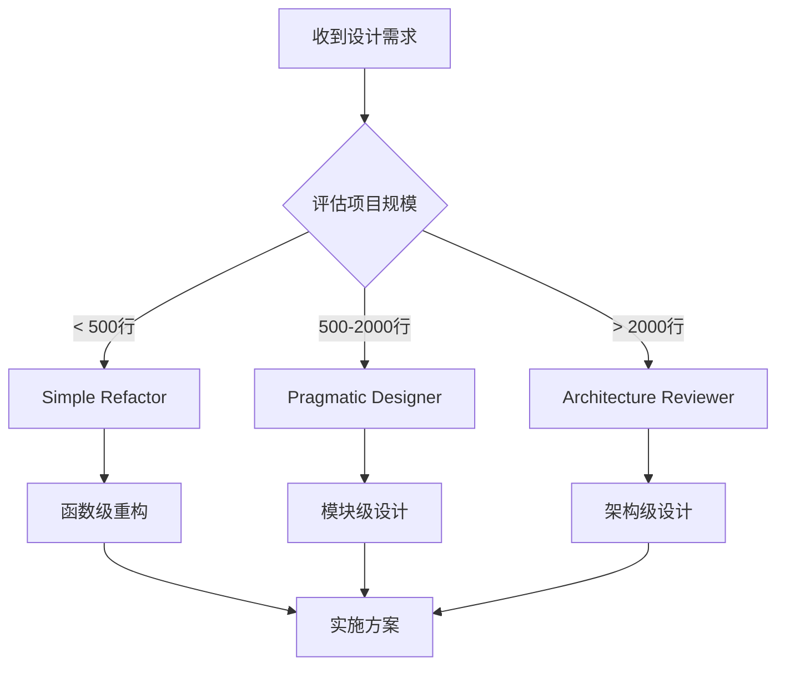

# Subagents 使用指南

## 目录结构
```
.claude/subagents/
├── simple-refactor.md      # 简单重构代理
├── architecture-reviewer.md # 架构审查代理  
├── pragmatic-designer.md   # 实用设计代理
└── README.md              # 使用指南
```

## 使用场景

### 🛠️ Simple Refactor Agent
**何时使用**：
- 代码行数 < 500行
- 功能相对简单
- MVP或原型阶段
- 需要快速重构

**调用方式**：
```
@simple-refactor 帮我重构这个函数，让它更清晰
```

### 🔍 Architecture Reviewer Agent  
**何时使用**：
- 评估设计方案
- 防止过度设计
- 需要第二意见
- 架构决策前

**调用方式**：
```
@architecture-reviewer 评估一下我的这个架构设计
```

### ⚖️ Pragmatic Designer Agent
**何时使用**：
- 需要平衡性方案
- 中型项目设计
- 考虑演进路径
- 成本敏感项目

**调用方式**：
```
@pragmatic-designer 给我一个实用的重构方案
```

## 决策流程



## 质量标准

所有设计方案必须通过以下检查：
- ✅ 解决当前问题
- ✅ 代码可读性提升
- ✅ 测试覆盖可行
- ✅ 维护成本合理
- ✅ 有明确的价值产出

## 注意事项
1. 优先选择简单方案
2. 避免为未来不确定需求过度设计  
3. 每次重构专注一个问题
4. 保持代码可以正常运行